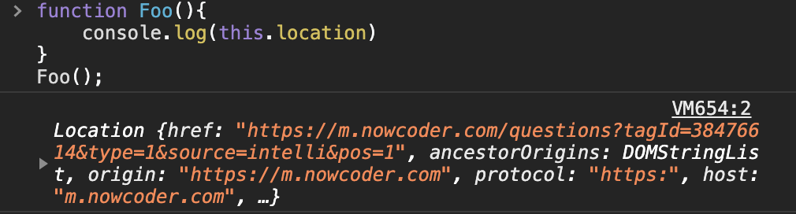

# js

## js的this指向

1. ```javascript
   function Foo(){
       console.log(this.location)
   }
   Foo();
   ```

   

## js 原型

1. ```javascript
   function A() {
       this.do = function() { return 'foo' }
   }
   A.prototype = function () {
       this.do = function() { return 'bar' }
   }
   var x = new A().do();
   console.log(x) // foo
   ```

2. 

## js 字符串匹配

> 从字符串 const str = 'qwbewrbbeqqbbbweebbbbqee';中能得到结果 ["b", "bb", "bbb", "bbbb"] 以下错误语句是？ B
>
> A . str.match(/b+/g)
>
> B. str.match(/b*/g)
>
> C. str.match(/b{1,4}/g)
>
> D. str.match(/b{1,5}/g)

## Js 数组

> 如何判断一个js对象是否是Array,arr为要判断的对象，其中最准确的方法是？ D
>
> A . typeof(arr)
>
> B. arr instanceof Array
>
> C. arr.toString==='[object Array]';
>
> D. Object.prototype.toString.call(arr) === '[object Array]';