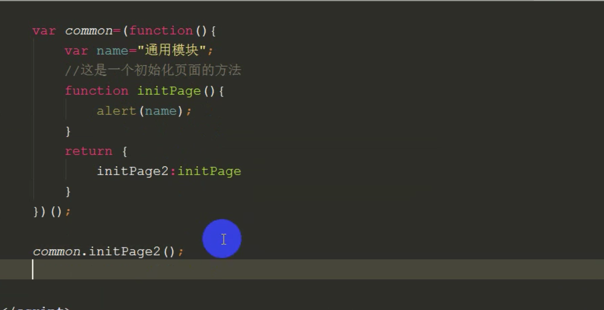
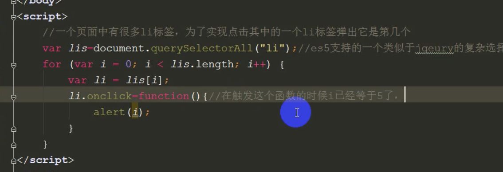
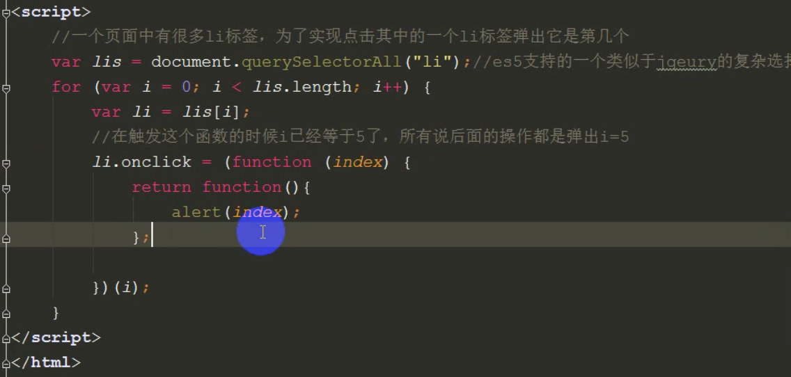
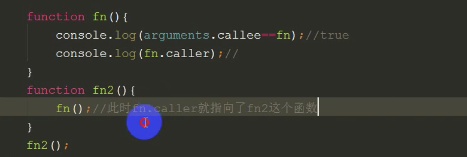
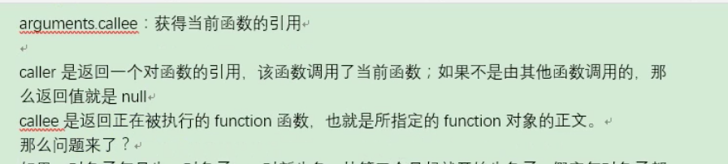
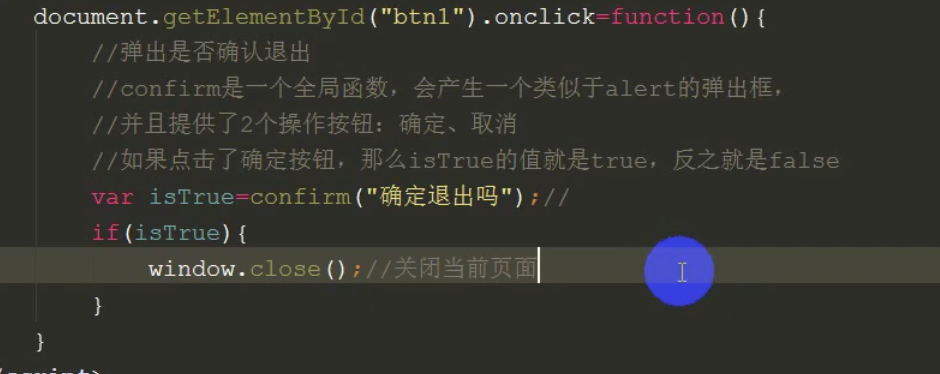

​	常用css3动画属性

left: 100%是什么意思

translate与left有什么区别，性能translate好

translate:视觉变化

left:实际移动

MVC与MVVM, 区别，有什么库， react单向数据流（父组件到子组件）

聊天技术：socket

redux

promise

async awiat


重绘回流

检测数组

传统事件绑定与符合W3C的标准事件绑定

DOM事件流

---

检测数组

```js
typeof isNaN  === function

Array.isArray() es5

toString.call([])  [object Array]

Arr.constructor  // 不严谨，因为constructor属性可读可写

[] instanceof Array
```

---

事件绑定

```html
// 传统事件绑定
div.onclick = function
<div onclick="" ></div>
```

传统事件绑定：不支持DOM事件流：事件捕获阶段 = 》 目标元素阶段 =》事件冒泡阶段

符合W3C的标准事件绑定：addEventListener/attachEvent
addEventListener（'click'，function(){}，[true/false]）
1：事件类型
2：事件执行的函数
3：是否在事件捕获阶段执行，默认值是false，不是必填参数 ，false表示在事件冒泡阶段执行。

attachEvent：事件类型参数必须携带  on， 没有第三个参数,所以只能在事件冒泡执行，不支持事件捕获。

---

IE 与 标准浏览器的兼容写法

1. 获取触发事件的对象

```js
ev = ev || window.event 
```

```js
addEventListener（'click'，function(ev = ev || window.event){}，[true/false]）
```

2. 获取屏幕宽度

```js
document.documentElement.clientWidth || document.body.clientWidth
```

3. 获取触发事件的源对象

```js
var target = ev.srcElement || ev.target
```

---

call与apply的区别

都是改变执行环境的,改变 this指向的。

//  就是让一个本来不属于这个对象的方法可以让这个对象执行。

作用：

```js
var obj1 = { say: function() { console.log('说话') } }
var obj2 = { eat: function() { console.log('吃饭') } }

obj2.eat.call(obj1)
```

如果带参数，call与apply是存在区别的

```js
var obj1 = { say: function() { console.log('说话') } }
var obj2 = { eat: function(name, age) { console.log(name, age) } }
```

call传参与apply传参

```js
obj2.eat.call(obj1, '账单', 13)
obj2.eat.apply(obj1, ['你好', 14])
```

---

javaScript 继承

---

Javascript 创建对象

动态原型


对象字面量

Object构造函数

纯构造函数

空构造函数 + 原型

混合构造函数 + 原型

动态原型

寄生构造函数

Object.create()

---

this指针，闭包，作用域

闭包：1.  内层函数可以访问外层函数的变量 

2. 可以实现模块化

   

3. 



变量搜索机制

---

如何阻止事件冒泡

```js
e.stopPropagation() // 标准

event.cancelBubble = true  // ie9-
```

如何阻止默认事件

```js
return false

e.preventDefault()
```

---

js同源策略

一段文本只能读取同一个来源的窗口和文档的属性，同一来源指的是，协议端口与主机都一致。

---

js是什么语言，特点

面向对象，动态语言，浏览器js引擎也可以运行在nodejs上

---

事件流

---

undefined的情况

1. 变量定义了但是没有被赋值属性
2. 获取对象上不存在的属性和方法
3. 一个数组中没有被赋值的元素

---

数组倒排

1. arr.reverse()
2. 定义新数组，减循环，push

---

正则

---

清除字符串前后空格

---

callee与caller

arguments.callee  等于原函数

arguments.caller 等于被调用的函数





---

关闭窗口



---

rem与em， vw 与 vh

rem 根元素的字体大小

em 父级元素的字体大小

---

常用的css选择器: id，类，标签，通配符，伪类， 属性，子代选择器，

属性选择器：type[checkbox]

权重：权重可叠加

---

定位：固定（浏览器窗口），绝对（父级或者浏览器窗口），相对（本身），区别

---

BFC

---

import 与 link的区别

---

数组api  === 作用 和 返回值，哪个会返回当前数组，哪个要复制，ES6新增的数组方法

push的返回值是push之后数组的长度

pop/shift返回的是弹出的值

---

闭包优缺点，定义

变量不会被回收

内存的性能

---

原型链

每个构造函数都

---

instanceOf 的实现方式

---

Set / Map 与 Promise(解决函数回调地域，有几个api)

---

Class语法

---

Vue生命周期

---

Data为什么是函数不是属性

---

watch与computed

---

import 与 link

link 权重大。

 link 同步加载，没有兼容性的问题。

---

cookie缺点：

对 cookie的数量有限制，ie6以下最多有20个。

大小：4K

---

token

---

伪类与伪元素：https://www.cnblogs.com/andy-lehhaxm/p/9561776.html

---

inline-block 与 float: https://www.cnblogs.com/scot/p/5501669.html

---

XMLHttpRequest

---

浏览器

浏览器缓存

https怎么加密

---

vue的性能优化

---

串行的promise（promise设计模式，reject与catch）

---

实现一个观察类

---

字符串翻转

---

vue响应式原理

---

重绘与重排（减少重排）

---

webpack

---

跨域

---

let / const /var

const 与 let 声明同一个会怎么样， const 常量是对象，属性的值能不能改变

---

v-if与v-else

---

状态码，302能不能重定向到不同域名下的

---

箭头函数与普通函数的作用域

---

什么时候会使用 valueOf 与 toString()

---

之后还想学哪方面的

---

有什么问题要问

---

介绍项目

---

## target、currentTarget的区别？

currentTarget当前所绑定事件的元素

target当前被点击的元素

---

实现一个观察类（on, emit, remove）

---

响应式原理

---

手写一个正则

---

